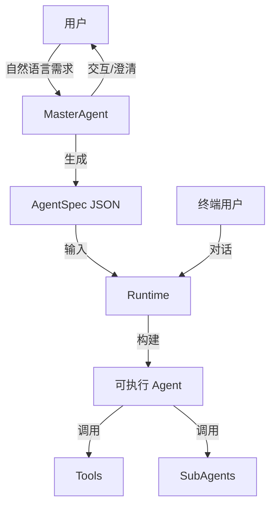

# Agent Foundry

基于 **LangChain** 和 **AG-UI Protocol** 的 Agent Foundry 实现。采用 **MasterAgent** + **Runtime** 的两阶段架构：通过自然语言对话创建 Agent 配置 (AgentSpec)，然后基于配置构建和执行 Agent。

## 简介

Agent Foundry 是一个用于快速构建、配置和运行 AI Agent 的框架。它不仅提供了代码层面的抽象（Factory, Runtime），还包含了一个交互式的 **MasterAgent**，能够通过自然语言引导用户完成 Agent 的设计和配置。

## 目录结构

```bash
src/agent_foundry/
├── __init__.py
├── constants.py
├── schemas.py             # 数据模型 (AgentSpec, RuntimeContext 等)
├── factory.py             # AgentFactory (底层构建逻辑)
├── runtime.py             # Runtime (Agent 执行层)
├── master_agent.py        # MasterAgent (对话式配置生成)
├── server.py              # AG-UI Server 实现
├── config/                # 配置文件
├── llm/                   # LLM 工厂与配置
└── tools/                 # 工具系统
    ├── __init__.py
    ├── registry.py        # 工具注册表
    └── ...                # 具体工具实现 (如 web_search.py 等)

examples/                  # 示例代码
├── basic_agent.py
└── agui_server.py
```

## 核心特性

- 🎯 **自然语言创建 Agent**: MasterAgent 通过对话引导用户，生成标准化的 AgentSpec。
- 🏗️ **两阶段架构**: 分离 "设计" (MasterAgent) 与 "执行" (Runtime) 关注点。
- 🔌 **AG-UI 协议支持**: 内置符合 AG-UI 标准的 SSE Server，支持流式交互和前端集成。
- 🔧 **动态工具系统**: 基于 `tool_registry` 的自动发现与注册机制。
- 🧩 **SubAgents 支持**: 支持嵌套子 Agent，实现复杂任务分解与上下文隔离。
- 📄 **自描述配置**: AgentSpec JSON 格式，易于存储、版本管理和迁移。

## 架构流程



### 阶段一: 打造 Agent (MasterAgent)

MasterAgent 是一个专门的 Agent，负责：

1. 理解用户需求（"创建一个帮我查天气和写诗的助手"）。
2. 使用 `ask_clarity_questions` 工具主动询问缺失信息（如模型选择、工具配置）。
3. 最终生成并保存符合规范的 `AgentSpec`。

### 阶段二: 使用 Agent (Runtime)

Runtime 负责将静态的 `AgentSpec` 转换为运行时的 LangGraph/LangChain 对象：

1. 解析 AgentSpec。
2. 从 Registry 加载所需工具。
3. 构建 SubAgents（如果存在）。
4. 启动 Agent 并处理用户交互。

## 核心组件详解

### 1. AgentSpec 规范

AgentSpec 是 Agent 的静态描述，定义在 `src/agent_foundry/schemas.py`：

```python
class AgentSpec(BaseModel):
    """Main Agent specification."""
    name: str = Field(description="Agent 名称 (英文标识符)")
    description: str = Field(description="职责描述")
    system_prompt: str = Field(description="系统提示词")
    model: str = Field(description="模型类型: pro 或 flash")
    temperature: float = Field(default=0.7, description="采样温度")
    tools: list[str] = Field(description="工具名称列表")
    subagents: list[SubAgentSpec] | None = Field(default=None, description="子 Agent 配置")
    version: str = Field(default="1.0", description="版本")
    max_iterations: int | None = Field(default=None, description="最大迭代次数")
```

### 2. Runtime 与 Factory

- **AgentFactory (`factory.py`)**: 负责底层的组装工作，如模型实例化、工具加载、SubAgent 包装。
- **Runtime (`runtime.py`)**: 面向应用层的入口，提供统一的 `build` 方法。

```python
from agent_foundry.runtime import Runtime
from agent_foundry.tools.registry import tool_registry

# 构建并运行
available_tools = tool_registry.get_all()
agent_graph = await Runtime.build(agent_spec=my_spec, all_available_tools=available_tools)
await agent_graph.ainvoke(...)
```

### 3. 工具系统 (`tools/`)

工具采用装饰器注册机制。

**添加新工具**:

1. 在 `src/agent_foundry/tools/` 下创建 Python 文件。
2. 使用 `@tool` 装饰器定义函数。
3. 确保模块被导入（通常在 `__init__.py` 或通过自动扫描）。

```python
from langchain_core.tools import tool

@tool
def my_custom_tool(query: str) -> str:
    """工具描述..."""
    return "result"
```

系统启动时会自动将其注册到 `tool_registry`。

### 4. AG-UI Server

项目内置了基于 FastAPI 的服务器，实现了 AG-UI 协议，支持流式输出 (SSE)。

**启动服务器**:

```bash
fastapi dev src/agent_foundry/server.py
```

**接口**:

- `POST /agui/master/run`: 运行 MasterAgent 进行配置生成。
- `POST /agui/runtime/run`: 运行指定的 AgentSpec。

## 开发指南

### 环境准备

使用 `uv` 或 `pip` 安装依赖：

```bash
uv sync
```

### 运行示例

参考 `examples/` 目录下的代码。

```bash
# 运行基础 Agent 示例
python examples/basic_agent.py
```

### 待办 / 规划中特性

- **SummarizationMiddleware**: 针对长对话的自动总结与上下文压缩机制。
- **Memory Persistence**: 集成持久化存储 (Postgres/Redis)。
