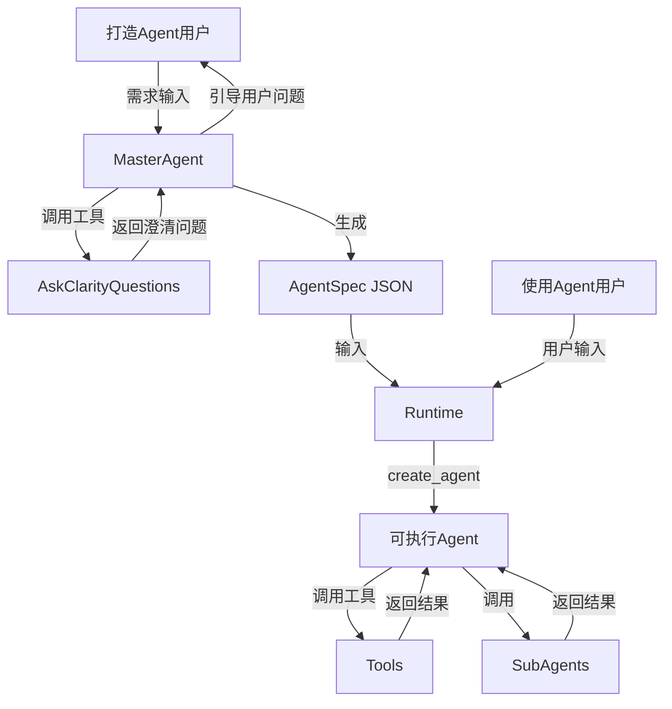

# Agent Foundry

>  自然语言方式打造Agent

## 架构设计：Factory/Runtime 分离

本项目采用 **Factory/Runtime 分离** 的架构，以保证代码的清晰度与可扩展性：

- **AgentFactory (`factory.py`)**：专注于"零件组装"。负责解析 `AgentSpec`，从注册表加载工具，处理子 Agent 的递归构建，并生成底层的 LangGraph 结构。
- **Runtime (`runtime.py`)**：专注于"成品交付"。它是 Agent 的运行环境包装层，负责注入持久化（Checkpointer）等运行参数。

> **建议**：在生产环境中，请始终通过 `Runtime.build()` 来构建您的 Agent。



## 目录结构（概览）

```bash
src/agent_foundry/
├── factory.py          # AgentFactory（底层创建与组装）
├── master_agent.py     # MasterAgent（对话式生成 AgentSpec）
├── runtime.py          # Runtime（从 AgentSpec 构建可执行 Agent）
├── schemas.py          # Pydantic 数据模型（AgentSpec/SubAgentSpec 等）
├── constants.py        # 常量定义（模型名称、默认值等）
├── config/
│   └── settings.py     # 配置管理（环境变量）
├── llm/
│   └── factory.py      # LLM 工厂
└── tools/
    └── registry.py     # tool_registry / register_tool
```

## 特性

- **两阶段架构**：对话式生成配置（MasterAgent）/ 基于配置执行（Runtime）
- **声明式配置**：Pydantic `AgentSpec`，可序列化为 JSON，便于存储与审查
- **动态工具系统**：全局 `tool_registry` + `register_tool` 装饰器，一键挂载到 MasterAgent/Runtime
- **子 Agent 支持**：`SubAgentSpec` 可嵌入主 Agent 配置，运行时自动包装为 tool

> 说明：当前版本内置 LLM 适配为 **OpenAI / OpenAI 兼容 Base URL**（见“环境变量配置”）。多 Provider 适配可以在后续扩展。

## 安装

```bash
pip install agent-foundry
```

或使用 uv：

```bash
uv add agent-foundry
```

## 环境变量配置

创建 `.env`（或直接设置环境变量）：

```bash
OPENAI_API_KEY=sk-...
OPENAI_BASE_URL=https://api.openai.com/v1  # 可选：兼容 OpenAI 的代理/网关

# 将 pro/flash 映射到真实模型名
PRO_MODEL=gpt-5.2
FLASH_MODEL=gpt-5-mini
```

## 快速开始

### 0) 用 AG-UI SSE Server（推荐，对外输出协议）

本项目提供 **AG-UI** 事件流（SSE）作为对外输出协议（详见 [AG-UI](https://docs.ag-ui.com/introduction)）。

启动服务：

```python
from agent_foundry import create_app

app = create_app()
```

```bash
uvicorn agent_foundry.server:create_app --factory --host 0.0.0.0 --port 8000
```

前端可用 `EventSource` 订阅（GET 方式，`payload` 为 URL 编码 JSON）：

```javascript
const payload = encodeURIComponent(JSON.stringify({
  model: "pro",
  messages: [{ id: "u1", role: "user", content: "帮我做一个能查询天气的 Agent" }]
}));
const es = new EventSource(`/agui/master/run?payload=${payload}`);
es.onmessage = (e) => console.log(JSON.parse(e.data));
```

### 1) 用 `AgentFactory` 直接创建一个工具调用 Agent

```python
from langchain_core.messages import HumanMessage
from langchain_core.tools import tool

from agent_foundry import AgentFactory


@tool
def get_weather(location: str) -> str:
    """查询天气（示例）。"""
    return f"{location}：晴，25°C"


agent = AgentFactory.create_agent(
    model="flash",
    tools=[get_weather],
    system_prompt="你是一个天气助手，优先调用 get_weather 获取信息，用中文回答。",
)

result = agent.invoke({"messages": [HumanMessage(content="北京天气怎么样？")]})
print(result["messages"][-1].content)
```

### 2) 用 `AgentSpec` + `Runtime`（声明式配置 → 构建可执行 Agent）

```python
import asyncio

from langchain_core.messages import HumanMessage
from langchain_core.tools import tool

from agent_foundry import Runtime
from agent_foundry.schemas import AgentSpec


@tool
def get_weather(location: str) -> str:
    """查询天气（示例）。"""
    return f"{location}：小雨，18°C"


spec = AgentSpec(
    name="weather_assistant",
    description="天气查询助手",
    system_prompt="你是一个天气助手，优先调用 get_weather 获取信息，用中文回答。",
    model="flash",
    temperature=0.7,
    tools=["get_weather"],
)


async def main():
    graph = await Runtime.build(
        agent_spec=spec,
        all_available_tools={"get_weather": get_weather},
    )
    result = await graph.ainvoke({"messages": [HumanMessage(content="上海天气？")]})
    print(result["messages"][-1].content)


asyncio.run(main())
```

### 3) 用 `MasterAgent`（对话式打造 Agent → 输出 `AgentSpec` JSON）

`MasterAgent` 会结合当前工具目录，尽量调用 `ask_clarity_questions` 返回结构化澄清问题，信息完整后输出**纯 JSON**。

```python
import asyncio

from langchain_core.messages import HumanMessage

from agent_foundry import MasterAgent


async def main():
    master = await MasterAgent.build(model="pro")

    result = await master.ainvoke(
        {"messages": [HumanMessage(content="帮我做一个能查询天气的 Agent，返回温度和建议。")]}
    )

    # 可能是澄清问题 JSON，也可能是最终 AgentSpec JSON（取决于对话进度）
    print(result["messages"][-1].content)


asyncio.run(main())
```

## 进阶（配置与扩展）

### AgentSpec（配置规范）

`AgentSpec` 是声明式配置入口（见 `agent_foundry.schemas.AgentSpec`）：

- **name**：英文标识符（如 `weather_assistant`）
- **description**：一句话描述
- **system_prompt**：系统提示词
- **model**：`"pro"` / `"flash"`（会映射到 `PRO_MODEL` / `FLASH_MODEL`）
- **temperature**：采样温度（0~2）
- **tools**：工具名称列表（必须在可用工具映射里）
- **subagents**：可选子 Agent（见 `SubAgentSpec`）

### 工具系统（Tool Registry）

推荐用 `register_tool` 将工具注册到全局 `tool_registry`，便于 `MasterAgent` 自动读取目录、以及 `Runtime` 一键加载。

```python
from langchain_core.tools import tool

from agent_foundry import register_tool, tool_registry


@register_tool
@tool
def search_database(query: str) -> str:
    """数据库检索（示例）。"""
    return f"results for: {query}"


all_tools = tool_registry.get_all()  # {name: BaseTool}
```

### 子 Agent（SubAgent）

当任务会产生大量中间输出（例如：网页抓取、长文本解析、复杂数据分析）导致主 Agent 上下文膨胀时，可把“重活”下沉到子 Agent。

`AgentFactory.assemble_agent()` / `Runtime.build()` 会把 `SubAgentSpec` 自动构建并包装为 `SubAgentTool`（主 Agent 以 tool 调用方式使用子 Agent）。

## 开发与测试

```bash
pytest
```

## License

MIT License - see [LICENSE](LICENSE) for details.
