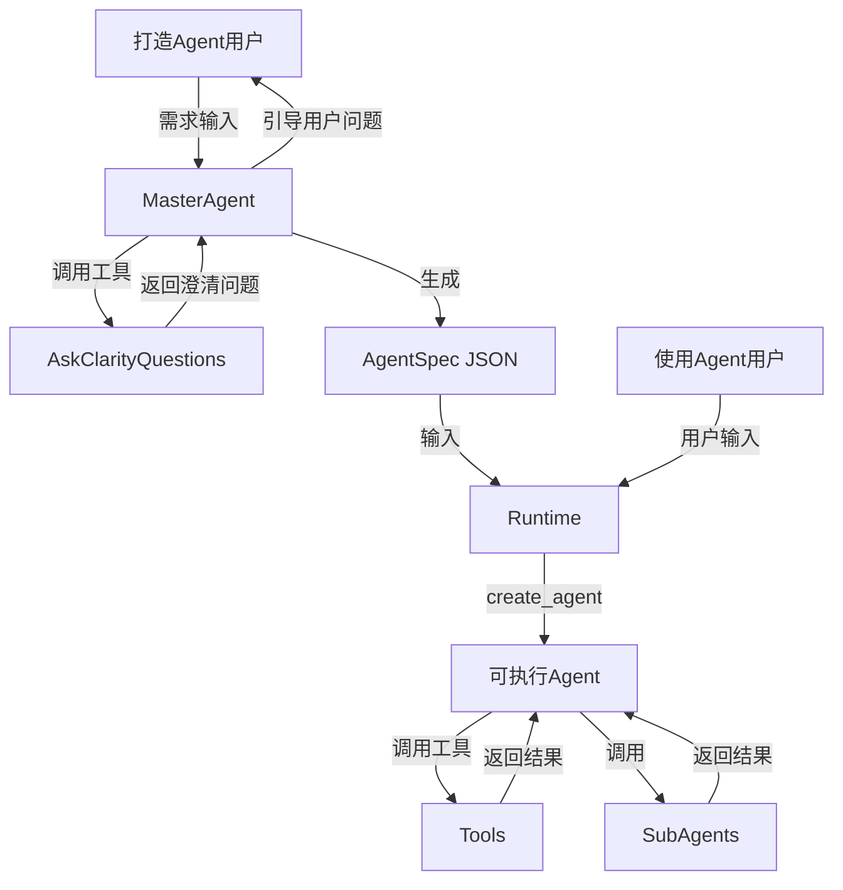

# LangChain 版本 Agent Foundry

> **重要说明**：本文档侧重架构设计和核心概念，提供关键 API 使用示例。完整实现请参考源代码，不包含所有细节代码。

## 简介

基于 **LangChain 1.1+** 的 Agent Foundry 实现，使用 `create_agent` 和 **Middleware** 架构。两阶段架构：通过自然语言对话创建 Agent 配置，然后基于配置执行 Agent。


## 目录结构

```bash
src/agent_foundry/langchain/
├── README.md              # 当前模块的架构说明与开发指南（本文件，已存在）
├── master_agent.py        # MasterAgent 实现，负责对话式 Agent 配置生成（规划中）
├── runtime.py             # Runtime 实现，根据 AgentSpec 构建可执行 Agent（规划中）
└── tools/                 # 工具目录（规划中）
    ├── __init__.py        # 工具注册逻辑，自动扫描和注册工具
    ├── weather.py         # 天气查询等示例工具
    ├── file_operations.py # 文件读写相关工具
    └── web_search.py      # 网络搜索相关工具

examples/                  # 示例 AgentSpec 配置等
└── langchain/
    └── weather_agent.json # 天气助手示例配置

tests/                     # 测试模块
└── langchain/
    ├── test_master_agent.py
    └── test_runtime.py
```

## 核心特性

- 🎯 **自然语言创建 Agent**: 通过对话定义 Agent 能力
- 🔧 **动态工具系统**: 支持工具注册、发现和动态加载
- 🔄 **交互式澄清**: 自动识别信息缺失,引导用户补充
- 🏗️ **LangChain 1.1+**: 基于 `create_agent` 和 Middleware 构建
- 📄 **自描述配置**: AgentSpec JSON 格式,易于存储和版本管理
- 🧠 **智能总结**: 集成 SummarizationMiddleware 处理长对话

## 两阶段流程总览



### 阶段一: 打造 Agent

MasterAgent 通过对话收集信息,生成 AgentSpec JSON:

1. **用户输入**: "创建一个天气查询 Agent,能查询国内外城市的实时天气"
2. **信息检查**: MasterAgent 调用 `ask_clarity_questions` 工具分析对话历史
3. **澄清交互**: 工具返回需要澄清的问题(如模型选择、工具配置)
4. **前端展示**: 前端展示选择题或开放问题,收集用户答案
5. **答案拼接**: 前端将"问题+答案"拼接成完整消息,继续对话
6. **生成配置**: 信息完整后,MasterAgent 输出 AgentSpec JSON

**输出示例**:

```json
{
  "name": "weather_assistant",
  "description": "天气查询助手，支持查询国内外城市的实时天气信息",
  "system_prompt": "你是一个天气查询助手，能够查询全球城市的实时天气信息。使用 fetch_weather 工具获取天气，用中文回复用户，并提供温度、天气状况、建议等有用信息。",
  "model": "flash",
  "temperature": 0.7,
  "tools": ["fetch_weather"]
}
```

### 阶段二: 使用 Agent

Runtime 根据 AgentSpec 构建可执行 Agent:

1. **加载配置**: 解析 AgentSpec JSON,验证格式
2. **工具加载**: 从工具注册表加载工具实例
3. **Agent 构建**: 使用 `AgentFactory` 构建 Agent,集成 SummarizationMiddleware
4. **执行**: 接收用户输入,执行 Agent,返回结果

---

## 核心组件详解

### 1. AgentSpec 规范

完整的 AgentSpec JSON Schema:

```python
class AgentSpec(BaseModel):
    """Agent 配置规范"""
    name: str = Field(description="Agent 名称(英文标识符)")
    description: str = Field(description="职责描述")
    system_prompt: str = Field(description="系统提示词")
    model: Literal["pro", "flash"] = Field(description="模型类型: pro (高质量,适合复杂任务), flash (快速响应,适合简单任务)")
    temperature: float = Field(default=0.5, description="采样温度: 0.3-0.5 (确定性任务), 0.7-1.0 (创造性任务)")
    tools: List[str] = Field(description="工具名称列表(必须与注册表中的工具名匹配)")
    subagents: Optional[List[SubAgentSpec]] = Field(default=None, description="子Agent")
    version: str = Field(default="1.0", description="配置版本")
    max_iterations: Optional[int] = Field(default=None, description="最大迭代次数")
    # 新增: SummarizationMiddleware 配置
    summarization: Optional[SummarizationConfig] = Field(default=None, description="对话总结配置")

class SubAgentSpec(BaseModel):
    """子Agent规范(简化版)"""
    name: str = Field(description="子Agent名称")
    description: str = Field(description="子Agent职责描述")
    system_prompt: str = Field(description="子Agent系统提示词")
    tools: List[str] = Field(description="工具名称列表")
    model: str = Field(description="模型类型")

class SummarizationConfig(BaseModel):
    """SummarizationMiddleware 配置"""
    enabled: bool = Field(default=True, description="是否启用总结")
    model: str = Field(default="flash", description="总结用模型")
    trigger_tokens: Optional[int] = Field(default=4000, description="触发总结的token阈值")
    trigger_messages: Optional[int] = Field(default=10, description="触发总结的消息数阈值")
    keep_messages: Optional[int] = Field(default=20, description="保留的最近消息数")
```

### 2. MasterAgent 实现

**核心思路**: 使用 `create_agent` 创建,集成 `SummarizationMiddleware` 处理长对话

**关键 API**: `create_agent()` + `SummarizationMiddleware`

**系统提示词设计**:

系统提示词需要指导 MasterAgent 引导用户提供完整信息，并智能判断是否需要子 Agent。包含以下核心内容：

**1. 基础信息收集**:

- Agent 名称、描述、系统提示词
- 模型选择（pro/flash）、温度参数
- 工具列表（从注册表中选择）

**2. 子 Agent 使用指南**:

MasterAgent 需要根据任务复杂度判断是否需要子 Agent：

**为什么使用子 Agent？**
子 Agent 解决上下文膨胀问题。当 Agent 使用输出较大的工具（网络搜索、文件读取、数据库查询）时，上下文窗口会迅速被中间结果填满。子 Agent 隔离这些详细工作——主 Agent 只接收最终结果，而不是产生它的数十个工具调用。

**何时使用子 Agent：**

- ✅ 多步骤任务，会 clutter 主 Agent 的上下文
- ✅ 需要自定义指令或工具的专业领域
- ✅ 需要不同模型能力的任务
- ✅ 希望主 Agent 专注于高层协调

**何时不使用子 Agent：**

- ❌ 简单的单步骤任务
- ❌ 需要保持中间上下文时
- ❌ 开销大于收益时

**子 Agent 配置要点：**

- 子 Agent 也有独立的 system_prompt、model、tools
- 子 Agent 可配置独立的 SummarizationMiddleware（阈值通常比主 Agent 低）
- 任务分解：将复杂任务拆解为多个子 Agent（如数据分析 → 数据清洗 → 可视化）

**3. 输出格式**：只输出符合 AgentSpec 规范的 JSON

**SummarizationMiddleware 配置**:

```python
# 使用 AgentFactory 创建 MasterAgent
agent = AgentFactory.create_agent(
    model="pro",
    tools=[ask_clarity_questions],
    middleware=[
        SummarizationMiddleware(
            model="flash",  # 总结用轻量模型
            trigger={"tokens": 4000, "messages": 10},  # 触发条件
            keep={"messages": 20},  # 保留最近消息
        )
    ],
    system_prompt=system_prompt,
)
```

**核心优势**:

- `AgentFactory` 封装底层细节：代码更简洁，易于维护
- `SummarizationMiddleware`：自动处理长对话，避免 token 超限
- 保留最近对话：保留关键上下文，避免信息丢失
- 降低成本：总结用轻量模型，平衡成本和质量

### 3. Runtime 实现 (AgentFactory)

**职责**: 根据 AgentSpec 构建可执行 Agent，使用 `AgentFactory` 统一管理构建过程。

**构建流程**:

1. **加载工具**: 从注册表加载 AgentSpec 中定义的工具
2. **处理子 Agent**: 将子 Agent 配置包装成 BaseTool
3. **配置 Middleware**: 按需添加 SummarizationMiddleware
4. **创建 Agent**: 调用 `AgentFactory.create_agent()` 构建可执行实例

**关键 API 示例**:

```python
from .factory import AgentFactory
from .middleware import SummarizationMiddleware

# 动态构建 Agent
agent = AgentFactory.create_agent(
    model=agent_spec["model"],  # 自动映射为 LLM 实例
    tools=loaded_tools,  # 从注册表加载的工具
    middleware=[
        SummarizationMiddleware(
            model=summ_config.get("model", "flash"),
            trigger={
                "tokens": summ_config.get("trigger_tokens", 4000),
                "messages": summ_config.get("trigger_messages", 10),
            },
            keep={"messages": summ_config.get("keep_messages", 20)},
        )
    ] if enable_summarization else [],
    system_prompt=agent_spec["system_prompt"],
)
```

**AgentFactory 职责**:

- **模型工厂**: 负责将字符串 ("pro", "flash") 转换为实际的 LangChain ChatModel
- **Memory 组装**: 负责将 Middleware 转换为 LangChain 的 Memory 或 Callback 机制
- **Agent 组装**: 最终调用 LangChain 的 `create_tool_calling_agent` 或其他构造函数

**核心优势**:

- 声明式配置：通过 `AgentFactory` 一行代码构建 Agent
- 可选总结：根据配置动态启用 SummarizationMiddleware
- 工具验证：加载时检查工具存在性，提供清晰错误信息
- 嵌套支持：子 Agent 自动包装，支持多级调用

**LCEL vs create_agent 对比**:

| 特性           | LCEL 方式              | Factory + Middleware               |
| -------------- | ---------------------- | ---------------------------------- |
| 代码复杂度     | 较高（手动组装 chain） | 较低（声明式配置）                 |
| 对话总结       | 手动实现               | 内置 SummarizationMiddleware       |
| 可扩展性       | 需要自定义逻辑         | 通过 middleware 组合，即插即用     |
| 维护成本       | 较高                   | 较低，符合 LangChain 1.1+ 最佳实践 |
| LangChain 版本 | 1.0                    | 1.1+（推荐）                       |

### 4. 工具系统

**工具定义**: 在 `tools/` 目录中创建 Python 文件,使用函数式定义和自动注册机制

- **创建工具**: 在 `tools/` 目录下新建 Python 文件（如 `weather.py`、`file_operations.py`）
- **使用装饰器**: 用 `@tool` 装饰器标记工具函数
- **类型注解**: 添加参数和返回值的类型注解
- **完整 docstring**: 描述功能、参数、返回值、可能的错误
- **自动注册**: 模块加载时自动扫描并注册所有 `@tool` 函数

**工具注册机制**:

- 提供 `TOOLS_REGISTRY` 全局注册表
- `register_tool()`: 注册工具到全局注册表
- `get_tool_by_name(name)`: 根据名称获取工具实例
- `get_all_tools()`: 获取所有可用工具
- `get_tool_catalog()`: 获取工具目录（JSON 格式，用于 MasterAgent 展示）

**使用方式**:

在 MasterAgent 和 Runtime 中导入使用:

```python
from tools import get_tool_catalog, get_tool_by_name

tools = get_tool_catalog()
# 返回: [{"name": "file_read", "description": "...", "parameters": {...}}, ...]

tool = get_tool_by_name("file_read")
```

**工具开发规范**:

1. **函数式定义**: 使用 `@tool` 装饰器
2. **类型注解**: 必须添加参数和返回值的类型注解
3. **完整 docstring**: 描述功能、参数、返回值、错误
4. **参数校验**: 在函数内进行输入验证
5. **错误处理**: 抛出清晰的异常信息

### 5. 子 Agent 工具

**设计思路**: 将子 Agent 配置包装成 LangChain BaseTool，支持嵌套调用和独立总结

**核心机制**:

1. **包装层**: 将子 Agent 封装为 BaseTool，符合工具调用规范
2. **递归构建**: 子 Agent 也可以拥有自己的工具和子 Agent
3. **独立总结**: 每个子 Agent 可配置独立的 SummarizationMiddleware

**关键特性**:

- 统一接口：主 Agent 通过工具调用方式使用子 Agent
- 上下文隔离：子 Agent 的对话总结不影响主 Agent
- 错误传播：子 Agent 执行错误向上传递给主 Agent
- 灵活配置：子 Agent 可使用不同模型、不同总结策略

**使用场景与决策指南**:

**为什么使用子 Agent？**
子 Agent 解决上下文膨胀问题。当 Agent 使用输出较大的工具（网络搜索、文件读取、数据库查询）时，上下文窗口会迅速被中间结果填满。子 Agent 隔离这些详细工作——主 Agent 只接收最终结果，而不是产生它的数十个工具调用。

**何时使用子 Agent：**

- ✅ 多步骤任务，会 clutter 主 Agent 的上下文（如：数据分析 → 清洗 → 可视化）
- ✅ 需要自定义指令或工具的专业领域（如：法律专家、财务分析）
- ✅ 需要不同模型能力的任务（主 Agent 用 pro，子 Agent 用 flash）
- ✅ 希望主 Agent 专注于高层协调，而非细节执行

**何时不使用子 Agent：**

- ❌ 简单的单步骤任务（如：单次天气查询）
- ❌ 需要保持中间上下文时（如：需要查看详细执行过程）
- ❌ 开销大于收益时（子 Agent 的额外调用成本）

**典型场景示例**:

- **复杂任务分解**：数据分析（主）→ 数据清洗（子）→ 报表生成（子）
- **领域专家模式**：通用助手（主）→ 法律专家（子）→ 财务专家（子）
- **工作流程编排**：项目管理（主）→ 任务分配（子）→ 进度跟踪（子）

### 6. SummarizationMiddleware 详解

**作用**: 自动总结对话历史，避免 token 超限，降低调用成本

**实现原理**:

1. **监控对话**: 持续监控对话 token 数或消息数
2. **触发条件**: 超过阈值时，使用轻量模型总结旧消息
3. **状态更新**: 将总结结果永久替换到对话历史中
4. **保留最近**: 保留最近 N 条消息完整内容，确保上下文完整

**核心权衡**:

| 维度         | 推荐配置                 | 说明               |
| ------------ | ------------------------ | ------------------ |
| **总结时机** | tokens=4000, messages=10 | 平衡触发频率和成本 |
| **保留消息** | keep_messages=20         | 保留足够上下文     |
| **总结模型** | flash（轻量）            | 降低成本，速度更快 |
| **主模型**   | pro（高质量）            | 确保任务执行质量   |

**使用建议**:

- **MasterAgent**: 必选，长对话场景必备
- **Runtime**: 推荐，长任务执行时启用
- **SubAgent**: 根据子任务复杂度决定（简单任务可关闭）

**调优指南**:

- 总结太频繁：提高 trigger 阈值
- 上下文丢失：增大 keep_messages
- 成本敏感：总结模型始终使用 flash
- 效果不佳：检查总结模型和主模型的匹配度

## 开发指南

### 项目结构

主要模块:

- `master_agent.py`: MasterAgent 实现,负责对话式 Agent 配置生成
- `runtime.py`: Runtime 实现,负责根据 AgentSpec 构建可执行 Agent
- `tools/`: 工具目录
  - `__init__.py`: 工具注册逻辑,自动扫描和注册工具
  - `weather.py`, `file_operations.py`, `web_search.py`: 具体工具实现
- `examples/langchain/`: 示例配置 (JSON 文件，与 `src` 同级的全局 `examples/` 目录下)
- `tests/langchain/`: 测试模块（与 `src` 同级的全局 `tests/` 目录下）

### 添加新工具

添加新工具的步骤:

1. 在 `tools/` 目录创建新文件（如 `my_feature.py`）
2. 使用 `@tool` 装饰器定义工具函数
3. 添加类型注解和完整 docstring
4. 重启应用自动注册

### 测试

**测试策略**: 优先集成测试，验证完整工作流，避免过度单元测试

**核心测试场景**:

1. **MasterAgent 流程测试**

   - 多轮对话收集信息
   - 澄清问题生成和交互
   - 验证输出符合 AgentSpec 规范

2. **Runtime 构建测试**

   - 根据 AgentSpec 成功构建 Agent
   - 工具加载和验证
   - 子 Agent 包装和嵌套

3. **端到端测试**

   - 完整流程：对话创建 Agent -> 保存配置 -> 加载执行 -> 完成任务
   - 测试不同类型 Agent（简单工具调用、多子 Agent）

4. **SummarizationMiddleware 测试**
   - 长对话触发总结
   - 验证总结后上下文保持完整性
   - 性能测试：token 使用降低效果

**关键原则**:

- 避免过度 mock：尽可能使用真实组件
- 关注集成点：Agent 构建、工具调用、子 Agent 集成
- 自动化覆盖率：端到端场景优先于单元测试

---

## 常见问题

### Q: 如何处理工具不存在的情况?

**A**: Runtime 在加载工具时会检查注册表,如果工具不存在会抛出明确的错误信息,列出所有可用工具。

### Q: SubAgent 会循环调用吗?

**A**: 可能会,建议设置 `max_iterations` 限制。每个 SubAgent 是独立的 tool 调用,受主 Agent 的迭代限制。

### Q: 是否支持工具热加载?

**A**: 当前版本需要重启应用来加载新工具。后续可考虑动态导入机制。

### Q: SummarizationMiddleware 会丢失重要信息吗?

**A**: 不会。它只总结旧消息并保留最近 N 条完整消息。建议 keep_messages 设置足够大（如 20 条），以保留关键上下文。

### Q: 何时使用 SummarizationMiddleware?

**A**: 建议：

- **必选**: MasterAgent（长对话场景）
- **推荐**: Runtime（执行长任务时）
- **可选**: SubAgent（根据子任务复杂度）

### Q: 总结频率太高怎么办?

**A**: 调整 trigger 阈值：

- 提高 tokens 阈值（如 4000 -> 6000）
- 提高 messages 阈值（如 10 -> 15）
- 或使用 fraction 基于比例触发

### Q: 如何调试 SummarizationMiddleware?

**A**: 可以：

1. 添加日志记录 middleware 触发时机
2. 检查对话历史，观察总结前后的变化
3. 调低 trigger 阈值，更容易触发总结进行测试

## 相关资料

- **LangChain 官方文档**
  - [LangChain Python 文档（1.1+）](https://python.langchain.com/docs/)
  - [Agents 与 `create_agent` 指南](https://python.langchain.com/docs/how_to/#agents)
  - [Tools 与工具调用](https://python.langchain.com/docs/how_to/#tools)

- **Agent Foundry 项目文档**
  - `docs/architecture.mdx`：整体架构与 LangGraph 实现概览
  - `docs/api-reference.mdx`：API 使用参考
  - `resource/api_documentation.md`：后端接口补充说明